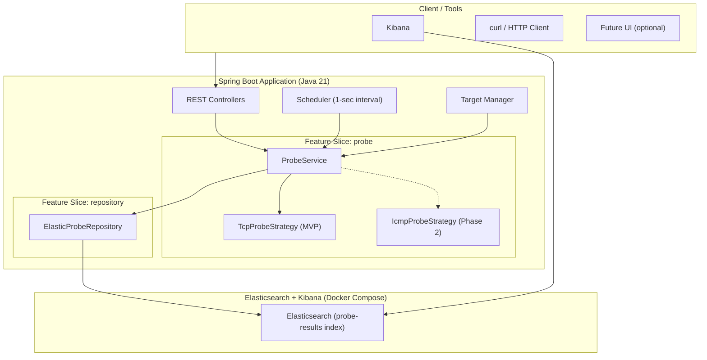
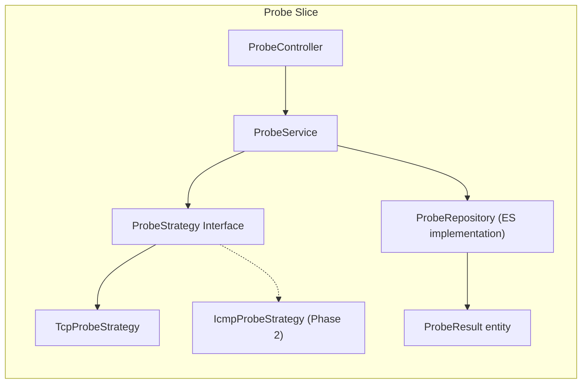
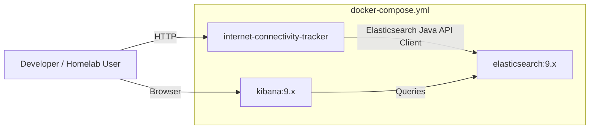
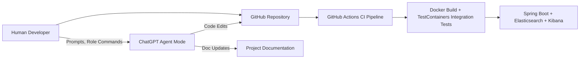

# **ARCHITECTURE.md**

# Architecture Overview

This document describes the system architecture for the **Internet Connectivity Tracker**, including:
- Vertical Slice Architecture (clean, feature-modular structure)
- Probe Strategy Pattern (TCP for MVP, ICMP in Phase 2)
- Elasticsearch time-series storage
- Docker Compose stack (Spring Boot + Elasticsearch + Kibana)
- Scheduling and round-robin multi-target probing

---

## 1. High-Level System Architecture



---

## 2. Vertical Slice Architecture

The application follows **Vertical Slice Architecture**, where each feature is isolated and contains *its own*:

* Controller
* Service
* Repository
* Data model(s)
* Mappers (if needed)
* Business logic + strategy classes

This avoids layered coupling and keeps features independent.

### Example Feature Slice (Probe)



---

## 3. Major Application Components

### **Scheduler**

* Executes every 1 second by default (configurable)
* Selects next target via round-robin
* Invokes `ProbeService`

### **Target Manager**

* Stores in-memory list of probe targets
* Supports multiple targets to distribute load

### **ProbeService**

* Coordinates probing workflow
* Selects probe strategy
* Converts low-level results into `ProbeResult`
* Persists results to Elasticsearch

### **Strategies**

**MVP:**

* `TcpProbeStrategy` (connect-to-port approach)

**Phase 2:**

* `IcmpProbeStrategy`
* `HybridProbeStrategy` (fallback chain)

### **Repository Layer**

* Elasticsearch Java API Client
* Writes to index: `probe-results`
* Provides simple query interfaces for:

  * latest result
  * filtered history
  * uptime/latency visualizations

---

## 4. Data Flow

1. Scheduler wakes every second.
2. Determines next target using round-robin.
3. Calls `ProbeService.probe(target)`.
4. Strategy executes (TCP by default).
5. Raw probe result converted to `ProbeResult`.
6. Repository writes result to Elasticsearch.
7. Kibana visualizes results from the `probe-results` index.

---

## 5. Docker Compose Stack

The system is deployed as:



### Services

| Service               | Purpose                    |
| --------------------- | -------------------------- |
| **Spring Boot App**   | Probing, API, scheduling   |
| **Elasticsearch 9.x** | Stores probe results       |
| **Kibana 9.x**        | Visualization + dashboards |

---

## 6. Testing Strategy

A comprehensive testing approach ensures reliability across fast-loop probing, Elasticsearch persistence, and Dockerized deployment. The Internet Connectivity Tracker uses three layers of tests:

1. **Unit Tests** (fast, isolated, pure-Java)
2. **Integration Tests** (Spring Boot context + TestContainers)
3. **System Tests** (full Docker Compose stack)

This testing strategy aligns with the Vertical Slice Architecture.

---

## **1. Unit Tests**

Unit tests validate individual classes in isolation using JUnit 5, AssertJ, and Mockito.

### **Goals**

* Validate business logic inside each slice
* Ensure strategies behave correctly
* Guarantee repository logic works when Elasticsearch is mocked
* Offer very fast feedback during development (sub-second execution)

### **Typical Unit-Tested Components**

#### **Probe Slice**

* `ProbeServiceTest`

  * verifies TCP probing flow
  * ensures failures convert correctly to `ProbeResult`
  * mocks strategies + repository
* `TcpProbeStrategyTest`

  * tests latency measurement logic
  * tests timeout behavior
* `RoundRobinTargetSelectorTest`

  * ensures target cycling correctness

#### **Repository Slice**

* `ElasticProbeRepositoryTest`

  * uses Mockito to stub Elasticsearch API client
  * verifies query construction
  * verifies index naming logic
  * validates error handling

#### **System Slice**

* `HealthControllerTest`
* `VersionControllerTest`

### **Key Tools**

* JUnit 5
* AssertJ
* Mockito
* Spring Boot Test (mock mode)

---

## **2. Integration Tests**

Integration tests load the **Spring Boot application context** and interact with real components. Elasticsearch is provided via **TestContainers**.

### **Goals**

* Validate Spring wiring per vertical slice
* Verify controller → service → repository pipeline
* Test Elasticsearch read/write behavior in a realistic environment
* Validate JSON serialization from REST endpoints
* Exercise the scheduler without real timing delays

### **Key Types**

#### **Controller-level Integration Tests**

* `ProbeControllerIT`
* `HistoryControllerIT`
* `TargetControllerIT`

These validate:

* endpoint contract
* request/response models
* status codes
* correct use of service layer

#### **Repository Integration Tests**

Using **TestContainers Elasticsearch**:

* Creates ephemeral ES instance
* Creates `probe-results` index
* Verifies inserts & queries
* Ensures mappings behave as expected

#### **Scheduler Integration Tests**

* Scheduler is triggered using Spring’s `TaskScheduler` test harness
* Ensures probing jobs start correctly
* Validates no memory leaks or cross-target interference

---

## **3. System Tests**

System tests run the entire stack via **Docker Compose**.

### **Goals**

* Validate end-to-end behavior
* Ensure Dockerized networking works
* Confirm the app can communicate with Elasticsearch in container mode
* Validate Kibana dashboards load data correctly
* Confirm round-robin target scanning works under load

### **System Test Activities**

* Bring up full stack:

  ```
  docker compose up --build
  ```
* Insert multiple targets through API
* Allow system to probe for 2–5 minutes
* Query:

  * `/api/status`
  * `/api/history`
* Confirm documents appear in Elasticsearch
* Load Kibana and check that index patterns + dashboards function

### **Optional Automated System Test Script**

A basic Python or Bash script can:

* bring stack up
* inject test targets
* poll endpoints
* verify Elasticsearch index counts
* tear down containers

---

## **4. Testing Coverage per Architecture Layer**

| Layer               | Unit Tests              | Integration Tests             | System Tests          |
| ------------------- | ----------------------- | ----------------------------- | --------------------- |
| Controllers         | Light (mappers, DTOs)   | Strong (JSON + HTTP)          | Indirect (full stack) |
| Services            | Strong (business logic) | Moderate (with ES)            | Indirect              |
| Strategies          | Strong                  | Light                         | Indirect              |
| Repository          | Mocked behaviors        | Strong with TestContainers ES | Strong                |
| Scheduler           | Fake clock              | Integration simulation        | Real-time scheduling  |
| Docker / Deployment | N/A                     | N/A                           | Strong                |

---

## **5. Automation**

### GitHub Actions Includes:

* `mvn verify` for unit + integration tests
* TestContainers runs headless
* Optional nightly **system test job**:

  * starts Docker Compose
  * runs smoke tests against real stack

---

## 6. Future Extensions

### Phase 2

* ICMP probe support
* Outage event detection
* Rollover indices + ILM
* Basic alerting

### Phase 3+

* Custom frontend dashboard
* Prometheus metrics
* Optional cloud deployment examples

---

## 7. Summary

This architecture is designed for:

* **Portfolio readability**
* **Modularity** (vertical slices)
* **Scalability** (Elasticsearch for time-series)
* **Observability** (Kibana dashboards)
* **Cross-platform probing** (TCP now, ICMP later)

---

# **8. AI-Assisted Development Architecture**

The **Internet Connectivity Tracker** uses AI tooling (ChatGPT Agent Mode) as part of its engineering workflow.
AI is *not* part of the runtime system; instead, it acts as a **development accelerator** that interacts with the repository and documentation during the build and maintenance lifecycle.

AI-assisted development enables:

* Automated code generation and refactoring
* Multi-file updates across controllers, services, repositories, and tests
* Consistent application of project conventions (Java 21, Spring Boot, Vertical Slices)
* Automated updates to project documentation
* DevOps pipeline and Docker configuration maintenance
* Test suite expansion using JUnit 5, AssertJ, and Testcontainers
* Architecture and API evolution through role-based prompts

This section formalizes how AI fits into the development architecture.

---

## **8.1 AI in the Development Lifecycle**

AI tools operate as part of a **sidecar development system**:



AI influences **code and documentation**, but plays **no role in runtime execution** of the application.

---

## **8.2 Role-Based AI Workflow**

The project uses a **Master Role Selector** that maps prompts into specific responsibilities:

* **Architect:** System design, slice boundaries, patterns, data-flow, ES index mapping strategy
* **Engineer:** Implements features, refactors code, builds slices, generates tests
* **QA:** Creates/updates unit tests, integration tests, system-test plans
* **DevOps:** Maintains Dockerfiles, docker-compose, GitHub Actions pipelines
* **Writer:** Updates documentation, README, diagrams, onboarding guides

AI uses these roles to maintain architectural consistency and ensure deterministic outputs.

---

## **8.3 AI-Assisted Feature Development**

AI accelerates development of new feature slices by generating:

* Controller/service/repository scaffolding
* Domain models and DTOs
* Elasticsearch queries using the ES 9.x Java API Client
* Strategy implementations (TCP, ICMP, Hybrid)
* Unit tests (JUnit 5 + AssertJ + Mockito)
* Integration tests (Spring Boot Test + Testcontainers)
* Updates to `/docs/API_SPEC.md` and `/docs/ARCHITECTURE.md`
* Updates to OpenAPI annotations in controllers

This creates a consistent, maintainable vertical-slice code structure.

---

## **8.4 AI-Assisted DevOps and Tooling**

AI maintains and evolves the project’s infrastructure:

### **Docker & Compose**

* Multi-stage Docker builds
* Optimized final images
* ES/Kibana stack configuration updates
* Version bumps aligned with ES 9.x compatibility

### **GitHub Actions**

* TestContainers-ready CI setup
* Maven caching
* Nightly system tests triggered through Docker Compose
* Automated linting and static analysis additions

### **Kibana & Elasticsearch Automation**

* Auto-generation of index templates
* Kibana dashboard JSON exports
* Data model consistency checks

---

## **8.5 AI-Assisted Documentation Management**

AI helps maintain:

* `/docs/ARCHITECTURE.md`
* `/docs/API_SPEC.md`
* `/docs/TEST_PLAN.md`
* `/docs/ROADMAP.md`
* `/docs/MASTER_ROLE_SELECTOR.md`
* `README.md` and onboarding guides

This ensures documentation evolves in lockstep with the application code.

---

## **8.6 Principles of AI Usage**

The project follows seven principles:

1. **AI accelerates development but does not replace engineering judgment.**
2. **The human developer is always the final decision maker.**
3. **All AI-generated code must be readable, testable, and idiomatic.**
4. **No AI-generated change is accepted without review and test coverage.**
5. **AI must follow established architectural patterns (Vertical Slice Architecture).**
6. **AI must not introduce deprecated or unstable APIs.**
7. **Documentation must always reflect the current state of the system.**

These principles ensure reliability and maintainability of the codebase.

---

## **8.7 Non-Goals for AI**

* AI is **not** used at runtime.
* AI does **not** perform live diagnostics inside the application.
* AI does **not** modify application behavior autonomously.
* AI does **not** replace system tests, load tests, or human review.

This keeps runtime concerns clean, deterministic, and production-safe.

---

## **8.8 Summary**

AI is integrated into the **development workflow**, not the runtime system.
The AI-assisted architecture:

* Improves engineering velocity
* Enforces architectural consistency
* Enhances documentation quality
* Ensures robust testing
* Supports long-term maintainability

The core runtime architecture remains a pure Java 21 + Spring Boot + Elasticsearch system following Vertical Slice Architecture principles.

---

## API Documentation

The application uses `springdoc-openapi` to automatically generate an OpenAPI 3 contract at runtime. The generated contract and interactive Swagger UI are available when the application is running at:

- OpenAPI JSON: `/v3/api-docs`
- Swagger UI: `/swagger-ui.html`

These endpoints are treated as the source of truth for the HTTP contract and can be used in CI to validate the API surface.

See `/docs/API_SPEC.md` for endpoint definitions.
