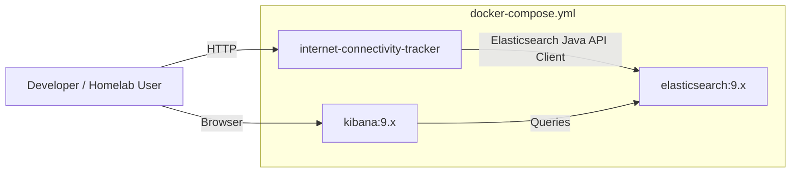

# **ARCHITECTURE.md (Updated)**

````markdown
# Architecture Overview

This document describes the system architecture for the **Internet Connectivity Tracker**, including:
- Vertical Slice Architecture (clean, feature-modular structure)
- Probe Strategy Pattern (TCP for MVP, ICMP in Phase 2)
- Elasticsearch time-series storage
- Docker Compose stack (Spring Boot + Elasticsearch + Kibana)
- Scheduling and round-robin multi-target probing

---

## 1. High-Level System Architecture

```mermaid
flowchart TD

    subgraph Client["Client / Tools"]
        Kibana
        curl["curl / HTTP Client"]
        App["Future UI (optional)"]
    end

    Client --> API

    subgraph AppContainer["Spring Boot Application (Java 21)"]
        API["REST Controllers"]
        SCHED["Scheduler (1-sec interval)"]
        TARGETS["Target Manager"]
        
        subgraph ProbeSlice["Feature Slice: probe"]
            PROBE_SERVICE["ProbeService"]
            STRATEGY["TcpProbeStrategy (MVP)"]
            ICMP["IcmpProbeStrategy (Phase 2)"]
        end

        subgraph RepoSlice["Feature Slice: repository"]
            ES_REPO["ElasticProbeRepository"]
        end

        API --> PROBE_SERVICE
        SCHED --> PROBE_SERVICE
        TARGETS --> PROBE_SERVICE
        PROBE_SERVICE --> STRATEGY
        PROBE_SERVICE -.-> ICMP
        PROBE_SERVICE --> ES_REPO
    end

    subgraph ElasticStack["Elasticsearch + Kibana (Docker Compose)"]
        ES["Elasticsearch (probe-results index)"]
        Kibana
    end

    ES_REPO --> ES
    Kibana --> ES
````

---

## 2. Vertical Slice Architecture

The application follows **Vertical Slice Architecture**, where each feature is isolated and contains *its own*:

* Controller
* Service
* Repository
* Data model(s)
* Mappers (if needed)
* Business logic + strategy classes

This avoids layered coupling and keeps features independent.

### Example Feature Slice (Probe)

```mermaid
flowchart TD
    subgraph FeatureSlice["Probe Slice"]
        direction TB

        Controller["ProbeController"]
        Service["ProbeService"]
        Strategy["ProbeStrategy Interface"]
        TcpImpl["TcpProbeStrategy"]
        IcmpImpl["IcmpProbeStrategy (Phase 2)"]
        Repo["ProbeRepository (ES implementation)"]
        Model["ProbeResult entity"]
    end
    
    Controller --> Service
    Service --> Strategy
    Strategy --> TcpImpl
    Strategy -.-> IcmpImpl
    Service --> Repo
    Repo --> Model
```

---

## 3. Major Application Components

### **Scheduler**

* Executes every 1 second by default (configurable)
* Selects next target via round-robin
* Invokes `ProbeService`

### **Target Manager**

* Stores in-memory list of probe targets
* Supports multiple targets to distribute load

### **ProbeService**

* Coordinates probing workflow
* Selects probe strategy
* Converts low-level results into `ProbeResult`
* Persists results to Elasticsearch

### **Strategies**

**MVP:**

* `TcpProbeStrategy` (connect-to-port approach)

**Phase 2:**

* `IcmpProbeStrategy`
* `HybridProbeStrategy` (fallback chain)

### **Repository Layer**

* Elasticsearch Java API Client
* Writes to index: `probe-results`
* Provides simple query interfaces for:

  * latest result
  * filtered history
  * uptime/latency visualizations

---

## 4. Data Flow

1. Scheduler wakes every second.
2. Determines next target using round-robin.
3. Calls `ProbeService.probe(target)`.
4. Strategy executes (TCP by default).
5. Raw probe result converted to `ProbeResult`.
6. Repository writes result to Elasticsearch.
7. Kibana visualizes results from the `probe-results` index.

---

## 5. Docker Compose Stack

The system is deployed as:



### Services

| Service               | Purpose                    |
| --------------------- | -------------------------- |
| **Spring Boot App**   | Probing, API, scheduling   |
| **Elasticsearch 9.x** | Stores probe results       |
| **Kibana 9.x**        | Visualization + dashboards |

---

## 6. Testing Strategy

Architect:

Here is the **detailed testing strategy section** you requested — add this directly into **ARCHITECTURE.md** under a new `## Testing Strategy` header.

---

# **Testing Strategy**

A comprehensive testing approach ensures reliability across fast-loop probing, Elasticsearch persistence, and Dockerized deployment. The Internet Connectivity Tracker uses three layers of tests:

1. **Unit Tests** (fast, isolated, pure-Java)
2. **Integration Tests** (Spring Boot context + TestContainers)
3. **System Tests** (full Docker Compose stack)

This testing strategy aligns with the Vertical Slice Architecture.

---

## **1. Unit Tests**

Unit tests validate individual classes in isolation using JUnit 5, AssertJ, and Mockito.

### **Goals**

* Validate business logic inside each slice
* Ensure strategies behave correctly
* Guarantee repository logic works when Elasticsearch is mocked
* Offer very fast feedback during development (sub-second execution)

### **Typical Unit-Tested Components**

#### **Probe Slice**

* `ProbeServiceTest`

  * verifies TCP probing flow
  * ensures failures convert correctly to `ProbeResult`
  * mocks strategies + repository
* `TcpProbeStrategyTest`

  * tests latency measurement logic
  * tests timeout behavior
* `RoundRobinTargetSelectorTest`

  * ensures target cycling correctness

#### **Repository Slice**

* `ElasticProbeRepositoryTest`

  * uses Mockito to stub Elasticsearch API client
  * verifies query construction
  * verifies index naming logic
  * validates error handling

#### **System Slice**

* `HealthControllerTest`
* `VersionControllerTest`

### **Key Tools**

* JUnit 5
* AssertJ
* Mockito
* Spring Boot Test (mock mode)

---

## **2. Integration Tests**

Integration tests load the **Spring Boot application context** and interact with real components. Elasticsearch is provided via **TestContainers**.

### **Goals**

* Validate Spring wiring per vertical slice
* Verify controller → service → repository pipeline
* Test Elasticsearch read/write behavior in a realistic environment
* Validate JSON serialization from REST endpoints
* Exercise the scheduler without real timing delays

### **Key Types**

#### **Controller-level Integration Tests**

* `ProbeControllerIT`
* `HistoryControllerIT`
* `TargetControllerIT`

These validate:

* endpoint contract
* request/response models
* status codes
* correct use of service layer

#### **Repository Integration Tests**

Using **TestContainers Elasticsearch**:

* Creates ephemeral ES instance
* Creates `probe-results` index
* Verifies inserts & queries
* Ensures mappings behave as expected

#### **Scheduler Integration Tests**

* Scheduler is triggered using Spring’s `TaskScheduler` test harness
* Ensures probing jobs start correctly
* Validates no memory leaks or cross-target interference

---

## **3. System Tests**

System tests run the entire stack via **Docker Compose**.

### **Goals**

* Validate end-to-end behavior
* Ensure Dockerized networking works
* Confirm the app can communicate with Elasticsearch in container mode
* Validate Kibana dashboards load data correctly
* Confirm round-robin target scanning works under load

### **System Test Activities**

* Bring up full stack:

  ```
  docker compose up --build
  ```
* Insert multiple targets through API
* Allow system to probe for 2–5 minutes
* Query:

  * `/api/status`
  * `/api/history`
* Confirm documents appear in Elasticsearch
* Load Kibana and check that index patterns + dashboards function

### **Optional Automated System Test Script**

A basic Python or Bash script can:

* bring stack up
* inject test targets
* poll endpoints
* verify Elasticsearch index counts
* tear down containers

---

## **4. Testing Coverage per Architecture Layer**

| Layer               | Unit Tests              | Integration Tests             | System Tests          |
| ------------------- | ----------------------- | ----------------------------- | --------------------- |
| Controllers         | Light (mappers, DTOs)   | Strong (JSON + HTTP)          | Indirect (full stack) |
| Services            | Strong (business logic) | Moderate (with ES)            | Indirect              |
| Strategies          | Strong                  | Light                         | Indirect              |
| Repository          | Mocked behaviors        | Strong with TestContainers ES | Strong                |
| Scheduler           | Fake clock              | Integration simulation        | Real-time scheduling  |
| Docker / Deployment | N/A                     | N/A                           | Strong                |

---

## **5. Automation**

### GitHub Actions Includes:

* `mvn verify` for unit + integration tests
* TestContainers runs headless
* Optional nightly **system test job**:

  * starts Docker Compose
  * runs smoke tests against real stack

---

## 6. Future Extensions

### Phase 2

* ICMP probe support
* Outage event detection
* Rollover indices + ILM
* Basic alerting

### Phase 3+

* Custom frontend dashboard
* Prometheus metrics
* Optional cloud deployment examples

---

## 7. Summary

This architecture is designed for:

* **Portfolio readability**
* **Modularity** (vertical slices)
* **Scalability** (Elasticsearch for time-series)
* **Observability** (Kibana dashboards)
* **Cross-platform probing** (TCP now, ICMP later)

```

---

See API_SPEC.md for endpoint definitions.
